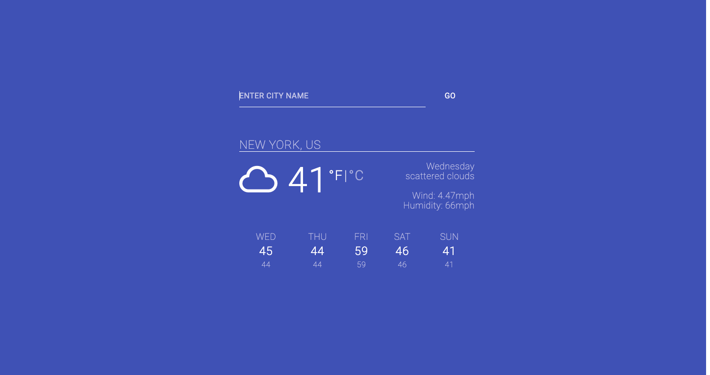

# Restaurant Page

[Restaurant Page](https://priceless-cori-e1d4a3.netlify.com/) is a minimal weather app built using modern JS as well as babel and webpack.


## Table of content

- [Description](#Description)
- [Installation](#installation)
- [Contact](#contact)

## Description

It is a minimal weather project that I built using modern JS.

## It uses the MVC structure in a way that:

- `Models` folder contains Daily, Forcast, Search
- `views` folder contains forecastView, formView and a base file for all DOM elements
- `index` which is the controller file

## It uses technologies such as

- Babel
- Webpack
- ESlint
- npm package manager
- ES6
- Modules

## Installation

1. Clone the project to your local directory

```
git clone https://github.com/KaushikShivam/rain_man
```

2. The project uses NPM for managing dependencies. Run npm install to install all the required dependencies

```
npm install
```

3. Run the task runner to run the app

```
npm run start
```

## Contact

You can contact me at:

- [Portfolio](https://www.shivamkaushik.com)
- [Email](mailto:shivamkaushikofficial@gmail.com)
- [Linkedin](https://www.linkedin.com/in/kshivamdev/)
- [Twitter](https://twitter.com/kShivamDev)
- [Medium](https://medium.com/@shivamkaushikofficial)
- [Angellist](https://angel.co/kshivamdev)
